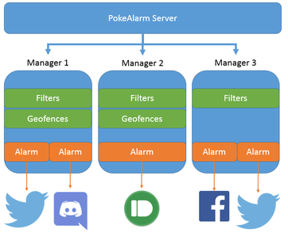

# PokeAlarm Version 3 Quick Start Guide
Updated: 4 Feb 2017

## Purpose
* This document is intended to quickly provide PokeAlarm v3 users with info to get started. It is not intended to replace the full wiki (which is being written up.)

## Before you begin
* Deadly has to eat! Get the word out about PokeAlarm and [send a tip his way for a job well done and to keep the features coming.](https://www.paypal.com/cgi-bin/webscr?cmd=_donations&business=5W9ZTLMS5NB28&lc=US&item_name=PokeAlarm&currency_code=USD)
* Version 3 is now in the master branch
* If you have experience with PokeAlarm v2, use the .example files in v3 root to quickly get started
* Version 2 is now in a separate branch, [v2](https://github.com/kvangent/PokeAlarm/tree/v2).
* This document is a work in progress
* Contact us in the [#troubleshooting discord channel](https://discordapp.com/channels/215181169761714177/218822834225545216) or open a ticket on our [github page](https://github.com/kvangent/PokeAlarm/issues)


## Notes

* If RocketMap is not configured to send moves or IVs for particular pokemon, e.g., `-eblk`, then you will get a `unknown` message for notifications if you do not set that particular pokemon to `"false"` in `filters.json`.  This behavior is intentional in PokeAlarm v3
* PyCharm is a very good IDE to manage your JSON and config files.  The EDU edition is free: https://www.jetbrains.com/pycharm-edu/

## Known issues
* RocketMap webhooks have been recently undergoing changes.  You may see errors related to `[MainProcess][Structures][ERROR] Invalid type specified (scheduler). Are you using the correct map type?` - your PokeAlarm setup will still function normally

## Introduction
PokeAlarm v3 takes advantage of multiprocessing to simplify running multiple configurations. To further simplify configuration, the `alarms.txt` as you know it in v2 has been split into `alarms.json` and `filters.json`.  Geofencing is still handled by `geofence.txt`, which now allows for multiple geofences in the same file.  You can add multiple config files in a list in `config.ini`.

Here's a visual on the PokeAlarm v3 workflow:



* The PokeAlarm Server is initiated by `start_pokealarm.py`.
* The number of managers is set etiher in the command line or `config.ini`
* Each manager is assigned a `filters.json`, `geofence.txt` (optional), and `alarms.json`
* `filters.json` contains the pokemon, gym, and pokestop configs
* `geofences.txt` is optional, and contains coordinates for one or more areas to limit notifications
* `alarms.json` contains one or more services, e.g., twitter, slack, discord, to send the custom notifications


## Command line parameters for start_pokealarm.py
```
usage: start_pokealarm.py [-h] [-d] [-H HOST] [-P PORT] [-m MGR_COUNT]
                          [-M MANAGERS] [-k KEY] [-f FILTERS] [-a ALARMS]
                          [-gf GEOFENCES] [-l LOCATION]
                          [-L {de,en,es,fr,it,zh_hk}] [-u {metric,imperial}]
                          [-tl TIMELIMIT] [-tz TIMEZONE]

Args that start with '--' (eg. -d) can also be set in a config file
(C:\Users\me\pgo\PokeAlarm-TESTING\config/config.ini). Config file syntax
allows: key=value, flag=true, stuff=[a,b,c] (for details, see syntax at
https://goo.gl/R74nmi). If an arg is specified in more than one place, then
commandline values override config file values which override defaults.

optional arguments:
  -h, --help            show this help message and exit
  -d, --debug           Debug Mode
  -H HOST, --host HOST  Set web server listening host
  -P PORT, --port PORT  Set web server listening port
  -m MGR_COUNT, --mgr_count MGR_COUNT
                        Number of Manager processes to start.
  -M MANAGERS, --managers MANAGERS
                        Names of Manager processes to start.
  -k KEY, --key KEY     Specify a Google API Key to use.
  -f FILTERS, --filters FILTERS
                        Filters configuration file. default: filters.json
  -a ALARMS, --alarms ALARMS
                        Alarms configuration file. default: alarms.json
  -gf GEOFENCES, --geofences GEOFENCES
                        Alarms configuration file. default: None
  -l LOCATION, --location LOCATION
                        Location, can be an address or coordinates
  -L {de,en,es,fr,it,zh_hk}, --locale {de,en,es,fr,it,zh_hk}
                        Locale for Pokemon and Move names: default en, check
                        locale folder for more options
  -u {metric,imperial}, --units {metric,imperial}
                        Specify either metric or imperial units to use for
                        distance measurements.
  -tl TIMELIMIT, --timelimit TIMELIMIT
                        Minimum number of seconds remaining on a pokemon to
                        send a notify
  -tz TIMEZONE, --timezone TIMEZONE
                        Timezone used for notifications. Ex:
                        "America/Los_Angeles"
```
## Changes to JSON files
The old `alarms.json` contained four sections - alarms, gyms, pokemon, pokestops.

In PokeAlarm v3, the configuration has been split between three files - filters, geofences, and alarms:

1. `filters.json` - handles what you know as the pokemon, gym, and pokestop settings
2. `geofence.txt` - handles geofences
3. `alarms.json` - handles alarms only

See the .example files in your PokeAlarm root directory for sample setups.

### filters.json
* The `pokemon:` section in the PokeAlarm v2 has been moved to its own file, `filters.json`.  The `pokemon:` key has been removed.
* You have two new options - `min_dist` and `max_iv` - to use.
    * `min_dist` - minimum distance for pokestop or gym to trigger alarm
    * `max_iv` - maximum %IV for pokemon (useful for a IV-specific range of pokemon)

You can still filter pokemon based on `min_iv`, `max_dist`, `move_1` and `move_2`.  For example, the code excerpt from `filters.json` below will look for a Venusaur with the moves Vine Whip and Solar Beam:

`"Venusaur":{ "min_iv":"0", "move_1":"Vine Whip", "move_2":"Solar Beam" },`


#### Gyms
* A new key, `ignore_neutral`, has been added.  This is to prevent those "It is now controlled by Neutral" gym messages.

 

Copy `filters.json.example` to `filters.json`.

### geofence.txt
In version 3, you are permitted to have multiple geofences in a single file.  In order to distinguish between different geofences, each set of coordinates in your geofence.txt file must contain a header with a set of brackets, like so:

```
[Central Park]
40.801206,-73.958520
40.767827,-73.982835
40.763798,-73.972808
40.797343,-73.948385

[Other Place]
61.801206,-100.958520
61.767827,-100.982835
61.763798,-100.972808
61.797343,-100.948385

```

PokeAlarm v3 will fail otherwise.

### alarms.json
the `alarms:[]` section in PokeAlarm v2 configuration file has been moved into its own file, `alarms.json`, and the `alarms:` key has been removed.  Otherwise, everything is the same.  You may copy your alarm configuration from v2 into v3.

Copy `alarms.json.example` to `alarms.json`.  


## Running PokeAlarm v3
Running `start_pokealarm.py` will start the PokeAlarm server and assume the following as default:

```
Host: 127.0.0.1
Port: 4000
filters: filters.json
alarms: alarms.json
```

Which is equivalent to running the command below:

`start_pokealarm.py -H 127.0.0.1 -P 4000 -f filters.json -a alarms.json`

## Running multiple alarms, filters, etc., in a single start_pokealarm instance
Version 3 requires a `filters.json` and `alarms.json`.  `Geofence.txt` is optional.

In the command line:

* `-f` - your desired `filters.json`
* `-gf` - your desired `geofences.txt`
* `-a` - your desiered `alarms.json`
* `-m` - number of total PokeAlarm managers

If you want just one maanger with one geofence, filter, and alarm config, run like so:

`start_pokealarm.py -f filters.json -gf geofences.txt -a alarms.json -m 1`

(`-m 1` is the default.  It's added above just for clarity.)

If you want to run 2 managers, each with it's own geofence, filters, and alarms, you need to specify them in your desired order like so:
 
`start_pokealarm.py -m 2 -f filters1.json -gf geofences1.txt -a alarms1.json -f filters2.json  -gf geofences2.txt -a alarms2.json`

This way, the configs are matched as so:

```
PokeAlarm Manager 1 - filters1.json, geofences1.txt, and alarms1.json
PokeAlarm Manager 2 - filters2.json, geofences2.txt, and alarms2.json
```

### Special case: using one `filters.json`, `geofence.txt`, `alarms.json`, etc., for all managers
Let's say you want one `filters.json` for two managers, like so:


PokeAlarm Manager 1 - `filters.json`, `geofences1.txt`, and `alarms1.json`

PokeAlarm Manager 2 - `filters.json`, `geofences2.txt`, and `alarms2.json```

If you only specify one `-f filters1.json` in the command line, PokeAlarm will assign that `filters1.json` to all managers.  For example:

`start_pokealarm.py -m 2 -f filters1.json -gf geofences1.txt -a alarms1.json -gf geofences2.txt -a alarms2.json`

to simply things, you can optionally set up lists these parameters in `config.ini`.


## Changes to config.ini
To faciliate multiple combinations of filters, alarms, geofences, etc., PokeAlarm v3 allows you add a list of these parameters in `config.ini`.

Let's say you want to run PokeAlarm for 2 areas - Brooklyn and Manhattan - with 2 filters each (`filters_main.json`, `filters_nearby.json`).  Each area has a defined geofence (`geofence_bk.txt` and `geofence_ny.txt`), and one alarm config each (`alarms_bk_v3.json` and `alarms_ny_v3.json`), for a total of 4 managers. 

Here's an example of how to configure config.ini:

```
key: YOUR_GOOGLE_MAPS_API_KEY
mgr_count: 4
location: [ "Brooklyn, NY", "Brooklyn, NY", "New York, NY", "New York, NY" ]
filter: [ filters_main.json, filters_nearby.json, filters_main.json, filters_nearby.json ]
geofence: [ geofence_bk.txt, None, geofence_ny.txt, geofence_ny.txt ]
alarms: [ alarms_bk_v3.json, alarms_bk_v3.json, alarms_ny_v3.json, alarms_ny_v3.json ]
timezone: America/New_York

```
* Order is important - the list elements are index matched with each other
* The geofence line in the example above contains a `None` entry, meaning that the second Manager will not use a geofence
* The `timezone` only lists `America/New_York`.  This timezone is applied to all 4 managers 

The following parameters can be set in a list in `config.ini`:
* key
* filters
* alarms
* geofences
* location
* units
* timelimit

## Final notes
The wiki is being overhauled to reflect the above notes and more.  If you have questions that haven't been addressed in this quick start guide, hit us up in the discord channel or submit a ticket on the Github page.  Happy Hunting!
